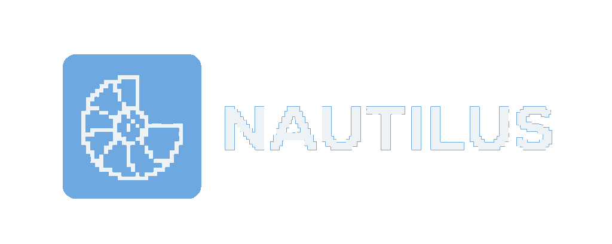

<div align="center">
  
  <br/>
  <h1>NAUT ERP Platform</h1>
  <p><strong>A unified, modular Enterprise Resource Planning (ERP) suite.</strong></p>
</div>

---

## 🚀 Project Vision

The NAUT platform is a cohesive, web-based Enterprise Resource Planning (ERP) suite. Built on a **Modular Monolith architecture**, the application integrates specialized business management tools under an immersive, aerospace and terraforming-inspired "Dark Aerospace" aesthetic.

Our goal is to seamlessly automate business operations—such as finance tracking, service booking, and inventory management—while maintaining an elite, cinematic, and highly interactive user experience.

## 🛠 Tech Stack

- **Backend:** Node.js, Express.js
- **Frontend:** EJS Templating, Vanilla CSS (Dark Aerospace Theme)
- **Database:** PostgreSQL / MySQL (Relational DB)
- **Architecture:** MVC (Model-View-Controller) / Modular Monolith

## 🧩 Core Modules (The Spokes)

The initial launch establishes three core pillars that operate independently but share a centralized database to automate cross-module workflows seamlessly:

### 1. Finance Analitica (The Ledger)
The financial heartbeat of the platform. It acts as a passive aggregator, listening to activities across the ecosystem to generate real-time financial insights.
- **Functions:** Tracks operating income, expenditure, and calculates net profit.
- **Visualization:** Real-time dashboards mapping cash flow trends.
- **Automation:** Automatically updates balances when services are booked or inventory supplies are purchased.

### 2. Service Management (The Calendar)
The operational scheduling engine designed to manage logistical booking and provider assignments.
- **Functions:** Interactive calendars for blocking dates and managing recurring operations.
- **Logistics:** Assigns personnel to tasks and processes client reservations.
- **Integration:** Triggers payment events upon service completion, automatically logging them into the Finance ledger.

### 3. Product Manejo (Inventory Management)
The asset tracking system for managing physical goods, raw materials, and product sales.
- **Functions:** Monitors real-time stock levels, calculates cost of goods sold (COGS), and manages supplier orders.
- **Integration:** Dynamically deducts from inventory when jobs in the Service module are executed. Purchasing materials logs an expense directly in the Finance module.

## 🏗 System Architecture

The platform structures logic using the Model-View-Controller (MVC) pattern. Data persistence is managed via a relational database to facilitate module cross-talk.

```text
naut_platform/
├── core/                       # The Shared Hub
│   ├── database/               # Relational DB Config
│   ├── routes/                 # Global routing (Auth, Dashboard)
│   └── views/                  # Shared UI templates
├── modules/                    # The Application Spokes
│   ├── finance/                # Controllers, Models, Routes
│   ├── services/               # Controllers, Models, Routes
│   └── inventory/              # Controllers, Models, Routes
├── public/                     # Static Assets (CSS, Logos)
└── server.js                   # Application Entry Point
```

## 🗺 Implementation Plan

1. **Phase 1: Foundation & Data Modeling**
   Establish the Node.js environment and design the relational database schema outlining exactly how a Transaction, Service Booking, and Inventory Item interact.
2. **Phase 2: Core Platform Routing**
   Build the core hub, establishing the unified dashboard view and basic navigation structure.
3. **Phase 3: Module Development**
   Construct the isolated logic for Finance, Services, and Inventory, ensuring the models accurately query the shared database.

## 💻 Getting Started

*(Instructions for local development setup will be added here as the foundation is established.)*

---
*Designed & Engineered for maximum operational uptime and sustained performance.*
